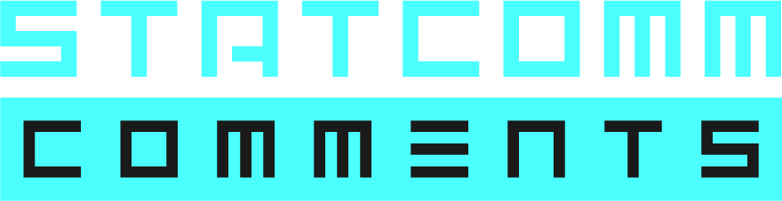
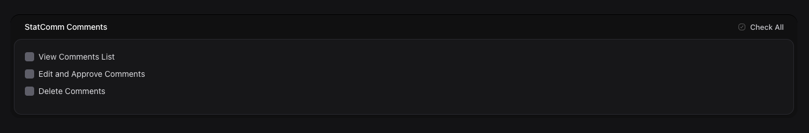

A high-performance, cyberpunk-themed Livewire 3 comment telemetry and tracking system integrated directly with the Statamic CMS core.

StatComm replaces heavy external comment frameworks with an integrated, repository-optimized array matrix. It handles validation constraints directly through your native Control Panel Form Blueprints, isolates assets dynamically, and ships with an integrated, pitch-black management interface right inside your Statamic sidebar menu layout.

---

## Features Matrix

- **Zero-Config Validation Sync:** Automatically parses your Statamic form blueprints (`blog_comments`) to dynamically match input constraints, validation rules, and requirement markers.
- **Decoupled Repository Query Streaming:** Leverages database-level pagination blocks instead of loading whole submission collections into active memory.
- **Invisible Spam Interceptors:** Equipped with automated un-validated honeypot properties and parent tracing matrix tags to intercept algorithmic bot runs silently.
- **Approval Only:** Only allow comments which have been manually approved by an admin.
- **Telemetry Widgets:** Includes responsive terminal feed components designed to loop source nodes, timestamp deltas, and origin entries onto public dashboards.
- **Control Panel Control Console:** A fully responsive audit matrix dashboard utilizing inline color maps, volumetric indicators, character density meters, and full data-purging (trace scrubbing) capabilities.

---

## System Requirements

- **PHP:** `^8.2`
- **Statamic CMS:** `^5.0` or `^6.0`
- **Laravel Livewire:** `^3.0`

---

## Installation Blueprint

### 1. Fetch Package Track

Initialize the uplink and download the package dependency via Composer:

```bash
composer require huement/statcomm
```

### 2. Publish Configuration & Blueprints

To initialize the backend form storage arrays, publish the baseline form blueprints directly to your project configuration directory:

```bash
php artisan vendor:publish --tag=statcomm-config
```

This creates a `blog_comments.yaml` engine map inside your resources/forms/ folder directory.

### 3. Publish Visual Canvas Layouts (Optional)

If you wish to modify the blade template html structures or customize the front-end style vectors to match your site layout profiles, publish the view assets:

```bash
php artisan vendor:publish --tag=statcomm-views
This copies your raw template blocks over to resources/views/vendor/statcomm/.
```

### 4. Publish Core Telemetry Styles (Optional)

To export the bundled administrative asset arrays directly into the application's public web root, call the asset tag:

```bash
php artisan vendor:publish --tag=statcomm-assets
This streams compiled CSS styles into public/vendor/statcomm/css/.
```

## Frontend Integration Uplink

### Component 1: The Interactive Comment Subsystem

To render the core comment intake form block along with its corresponding historical listing tree, place the livewire tag node inside your primary Blade or Antlers blog entry single post view layouts:

```html
{{-- Modern Livewire Tag Element Syntax --}}
<livewire:statcomm :articleId="$entry->id()" />

{{-- Alternative Blade Directive Syntax --}} @livewire('statcomm', ['articleId'
=> $entry->id()])
```

#### Custom Density Overrides

By default, the comment stream chunks items inside batches of 10. To alter the default list density dynamically on the fly per template section, pass an optional explicit :perPage parameter attribute:

```html
<livewire:statcomm :articleId="$entry->id()" :perPage="5" />
```

### Component 2: Recent Comments Telemetry Widget

To capture data updates globally and loop the latest transmission packets onto sidebars, headers, or separate control panels, mount the autonomous widget block:

```html
<livewire:statcomm-widget
    :limit="5"
    heading="Recent Comments"
    :showDate="true"
/>
```

**Available Parameters Matrix**
| **Variable Attribute** | **Data Type** | **Default Value** | **Functional Execution** |
|---|---|---|---|
| :limit | Integer | 5 | Controls the max row chunk cutoff pulled from the data buffer. |
| :heading | String | "RECENT_COMM_FEED" | Customizes the console header text label. |
| :showDate | Boolean | true | Toggles human-readable time-difference strings (diffForHumans()). |

### Control Panel Administration Dashboard

The package automatically extends your native Statamic navigation array, generating an autonomous **StatComm** item inside the _Tools_ group block menu.
Clicking the link navigates to a secure dashboard that calculates total logged submissions, charts character averages, tracks current timespan windows, features algorithmic initials generators, and allows you to audit user entries, execute structural content overrides, or permanently purge invalid entries.

#### PERMISSIONS

Statcomm has a number of permissions that it registers that you can easily control via the native Statamic Role configuration.



#### SECURITY

The plugin uses the best practices as outlined by the Statamic library for registering and controlling access to the comments admin routes: [https://statamic.dev/control-panel/routing](https://statamic.dev/control-panel/routing)

```php
  // 1. REGISTER THE SECURE CP DASHBOARD ROUTE
  $this->registerCpRoutes(function ($router) {
      $router->get('statcomm', [CpController::class, 'index'])->name('statcomm.index');
      ...
  }
```

---

## More Info

Please checkout the [docs/DESIGN.md](docs/DESIGN.md) document for planned features, and what is going to be coming in future updates. If you have suggestions, please let me know, if you want to help out, submit a pull request.

[docs/DESIGN.md](docs/DESIGN.md) Also contains a lot more info about the inner workings of the addon. I wanted to keep the readme light and only focus on what someone needs to get it working, not what is needed to develop it.

If people like this, and it gets a few stars, I will endeavor to bang out some of the cooler features such as sentiment analysis (filter out mean comments), and other cool stuff. This is just an early draft that I got working so my blog could have comments. My **HOPE** is that other people will try it out and like it and maybe it can be a rock solid way of getting people to interact with your Statamic articles.

### Developing

[docs/DEVELOPMENT.md](docs/DEVELOPMENT.md) contains all the info about contributing to the project, how to get setup to develop on it, if you need to change stuff, and what tests are currently written. Everything you would need to know to expand or tweak the project is there. PLEASE, if you end up creating a cool feature, submit a pull request!! I am all for collaberation.

---

### License & Sponsorship

Distributed freely under the open-source **MIT License**. Maintained, optimized, and engineered / sponsored by **[HUEMENT](https://huement.com/)**.

<p align="center">
  <strong>If this software saved you time or a headache, consider keeping the engine running!</strong><br><br>
  <a href='https://ko-fi.com/U1A7222617' target='_blank'>
    
  </a>
</p>

**NOTE** If you want a specific feature added to the plugin, I do freelance work and would be more than happy to work something out.
